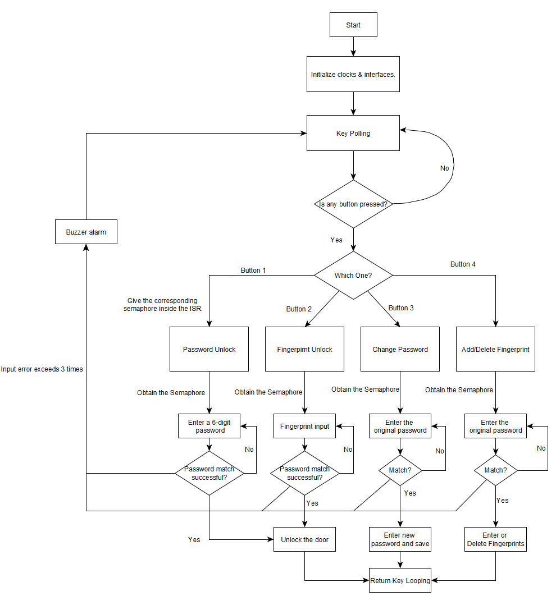
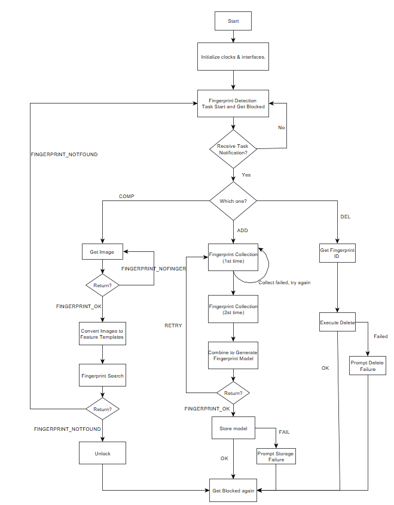
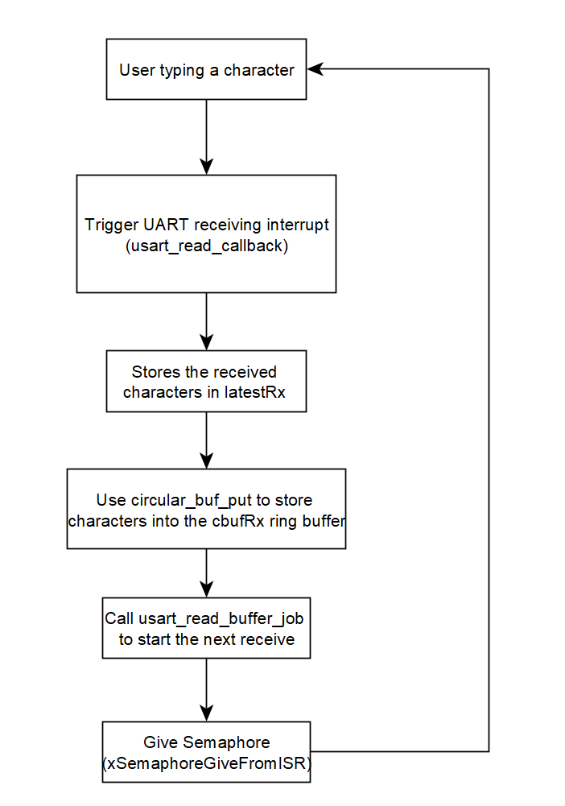

<!--
 * @Author: wyiwei1 wyiwei@seas.upenn.edu
 * @Date: 2025-03-18 22:48:58
 * @LastEditors: wyiwei1 wyiwei@seas.upenn.edu
 * @LastEditTime: 2025-03-23 21:27:46
 * @FilePath: \final-project-a07g-a14g-t11-keep-real\A07G_README.md
 * @Description: 这是默认设置,请设置`customMade`, 打开koroFileHeader查看配置 进行设置: https://github.com/OBKoro1/koro1FileHeader/wiki/%E9%85%8D%E7%BD%AE
-->
# a07g-exploring-the-CLI

* Team Number:11
* Team Name: Keep Real
* Team Members: Binsheng Zhang, Yiwei Wang
* GitHub Repository URL: https://github.com/ese5160/final-project-a07g-a14g-t11-keep-real.git
* Description of test hardware: SAMW25, Air Quality Sensor(BME680), Servo(SER0006), Matrix Keypad, Fingerprint Sensor, LCD Screen, Active Buzzer, laptop + Windows  

# 1. Software Architecture

## 1.1 Hardware Requirements Specification (HRS)

### 1.1.1 Overview

The project's hardware comprises a fingerprint sensor, a secure 4x4 matrix keypad for password input, and an SG90 servo motor for accurate lock simulation. The air quality sensor is used to detect data such as temperature, humidity, and air quality inside the house and display it on an LCD screen. A buzzer is used to trigger an alarm when necessary.

### 1.1.2 Definitions, Abbreviations

**ST7735**: Single-chip controller/driver for 262K-color, graphic type TFT-LCD.
**4x4 matrix keypad**: Traditional input method.
**SG90**: Servo motor controlled by PWM.
**BME680**: Environmental Sensor that combines a gas sensor with temperature, humidity and barometric pressure sensing

### 1.1.3 Functionality

- HRS 01 – Microcontroller Core
    - The project will focus on the SAM W25 microcontroller, offering Wi-Fi connectivity and powerful data processing to manage sensor inputs and control output devices. Interfaces include SPI, I2C, and UART, with an operating voltage of 3.3V.
- HRS 02 – Door Opening and Closing
    - The system shall be capable of accurately controlling SG90's rotation angle via PWM signals to simulate the locking and unlocking of a door. Connection for SG90: PWM, Voltage: 5V
- HRS 03 – Password Input
    - 4x4 matrix keypad shall be used to get the password input. Connection for Keypad：GPIO*8
- HRS 04 – Air Quality Monitoring
    - BME680 shall be able to measure air quality, temperature, humidity, and atmospheric pressure. Connection for BME680: I2C, Voltage: 3.3V
- HRS 05 – Fingerprint Detection
    - The fingerprint sensor shall be capable of detecting the user's fingerprint input and performing fingerprint storage and comparison. Connection for Fingerprint Sensor: UART, Voltage: 5V
- HRS 06 - Data Display
    - ST7735 shall be able to display air quality information and feedback from entered passwords. Connection for ST7735: SPI, Voltage: 3.3V
- HRS 07 - Buzzer Warning
    - The buzzer shall alarm if the password or fingerprint is entered incorrectly too many times. Connection for ST7735: GPIO, Voltage: 3.3V

## 1.2 Software Requirements Specification (SRS)

### 1.2.1 Overview

The software is responsible for managing user input and controlling hardware behavior, including the storage, recognition, and comparison of fingerprints and passwords. If the number of incorrect inputs exceeds the limit, the system will generate an alarm and control the locking and unlocking of the door. Additionally, the software reads parameters from the air quality sensor, displays air quality information on the LCD screen, and finally uploads alarm messages and air quality data to the cloud. Users can also control the locking and unlocking of the door remotely via the cloud.

### 1.2.2 Users

Suitable for users with large households, who care about indoor air quality, and prefer not to carry keys when going out.  

### 1.2.3 Definitions, Abbreviations

N/A

### 1.2.4 Functionality

- SRS 01 – Fingerprint Detection
    - When the user presses "A" on the keypad and enters a password, the software shall enter fingerprint enrollment mode, using the fingerprint sensor to capture and store the user's fingerprint.
    - When the user presses "B" on the keypad, the software shall switch to fingerprint recognition mode to capture the fingerprint and compare it with the stored fingerprints.
- SRS 02 – Password Input
    - When the user presses "C" on the keypad, the software shall enter password input mode and compare the entered password with the stored password.
    - When the user presses "D" on the keypad and enters a password, the software shall switch to password modification mode, saving the entered password as the new password.
- SRS 03 – Door Unlocking or Alarm
    - If the fingerprint or password matches correctly, the system shall control the servo motor to rotate, simulating unlocking.
    - If the user enters an incorrect fingerprint or password more than three times, the system shall send an alert notification to the cloud and activate the buzzer alarm.
    - If the user sends an unlock signal from the cloud, the system shall be able to recognize and execute the unlocking operation.
- SRS 04 – Air Quality Detection
    - The system shall measure air quality every 10 minutes, including humidity, temperature, and air pressure, and upload this data to the cloud.
- SRS 05 – Information Display
    - By default, the LCD screen shall display the current indoor temperature, humidity, and air pressure information.
    - If the user enters fingerprint input mode, the LCD screen shall display a prompt to guide the user to start entering their fingerprint.
    - If the user enters password input mode, the LCD screen shall display a prompt to guide the user to start entering the password.

## 1.3 Block Diagram

## 1.4 Flowcharts

### 1.4.1 Keypad  

### 1.4.2 Fingerprint Detection

### 1.4.3 Air Quality Dtection

### 1.4.4 LCD Display

### 1.4.5 Unlocking

### 1.4.6 Buzzer

# 2. Understanding the Starter Code

## 2.1 What does “InitializeSerialConsole()” do? In said function, what is “cbufRx” and “cbufTx”? What type of data structure is it?

- This function primarily initializes the UART (Universal Asynchronous Receiver/Transmitter) so the system can communicate via a serial interface. It configures the RX and TX pins, sets up the USART module for asynchronous communication, handles the logic for sending and receiving data, sets interrupt priorities, and finally launches a task that continuously reads incoming bytes.
- cbufRx and cbufTx are pointers to two circular buffers. cbufRx is used to store characters received from the UART. cbufTx is used to store characters that need to be transmitted via the UART.
- The data structure is defined in circular_buffer.c. The structure includes a buffer to store characters, write pointer, read pointer, buffer size and full indicator for circular buffer.

## 2.2 How are “cbufRx” and “cbufTx” initialized? Where is the library that defines them (please list the *C file they come from)

- They are initialized by calling the circular_buf_init() function, which allocates a circular_buf_t struct memory, sets the buffer pointer, the maximum capacity, and then resets the buffer state
- Lib: circular_buffer.c

## 2.3 Where are the character arrays where the RX and TX characters are being stored at the end? Please mention their name and size.

- The received and transmitted characters are ultimately stored in two character arrays defined in SerialConsole.c: rxCharacterBuffer and txCharacterBuffer. Both arrays are 512 bytes in size, as specified by the macros RX_BUFFER_SIZE and TX_BUFFER_SIZE in the file (both set to 512)

## 2.4 Where are the interrupts for UART character received and UART character sent defined? 

- The interrupt handling for receiving and sending UART characters is defined in the SerialConsole.c file by the callback function mechanism.
- usart_read_callback(struct usart_module *const usart_module) - handles an interrupt when a character is received
- usart_write_callback(struct usart_module *const usart_module) - Handles an interrupt when the character is sent

## 2.5 What are the callback functions that are called when: A character is received? (RX) A character has been sent? (TX)

- a. usart_read_callback(struct usart_module *const usart_module)
- b. usart_write_callback(struct usart_module *const usart_module)

## 2.6 Explain what is being done on each of these two callbacks and how they relate to the cbufRx and cbufTx buffers.

- usart_read_callback: Called when UART receives a character. The received characters (stored in latestRx) are stored in the receive ring buffer cbufRx. Use usart_read_buffer_job to start the next asynchronous receive and maintain the ability to receive continuously. cbufRx is used to store all received characters for reading by other tasks.  
- usart_write_callback: Called when UART finishes sending a character. Next, check if there is still data to send in the send ring buffer cbufTx. If there is data, fetch the next character to be sent (to latestTx). Start the next asynchronous send using usart_write_buffer_job. cbufTx is used to store all the characters to be sent, implementing the send queue. 

## 2.7 Draw a diagram that explains the program flow for UART receive – starting with the user typing a character and ending with how that characters ends up in the circular buffer “cbufRx”. Please make reference to specific functions in the starter code

## 2.8 Draw a diagram that explains the program flow for the UART transmission – starting from a string added by the program to the circular buffer “cbufTx” and ending on characters being shown on the screen of a PC (On Teraterm, for example). Please make reference to specific functions in the starter code. 

## 2.9 What is done on the function “startStasks()” in main.c? How many threads are started?

- Print heap memory size before job start.
- Creat a CLI task.  
- Print the heap memory size after the job started.
- This function starts only one thread, the CLI task.  

# 3. Debug Logger Module

# 4. Wiretap the convo!

## 4.1. What nets must you attach the logic analyzer to? (Check how the firmware sets up the UART in SerialConsole.c!)

- TX cable (data cable from SAMW25 to EDBG)
- RX cable (data cable sent by EDBG to SAMW25)
- GND (ground wire, for reference)

## 4.2. Where on the circuit board can you attach / solder to?

Pin10, Pin11, GND

## 4.3. What are critical settings for the logic analyzer

- Enable the "Async Serial" analyzer in Saleae Logic
- Set the baud rate to 115200
- Data bit: 8
- Stop bit: 1
- Parity check: None
- Bit order: LSB first (least significant bit first)
- Select the matching channel (we chose Channel 4)

## 4.4. Submit a photo of your hardware connections between the SAMW25 Xplained dev board and the logic analyzer.

## 4.5. Submit a screenshot of the decoded message

## 4.6. Submit a small capture file (i.e., the .sal file) of a wiretapped conversation

[small capture file](a07g_4.sal)

# 5. Complete the CLI

[Code](<CLI Starter Code/src/CliThread/CliThread.c>)

[Code](<CLI Starter Code/src/CliThread/CliThread.h>)

# 6. Add CLI commands

1. Commit your functioning CLI code to your GitHub repo, and make comments that are in Doxygen style.

[Code](<CLI Starter Code/src/CliThread/CliThread.c>)

[Code](<CLI Starter Code/src/CliThread/CliThread.h>)

2. Submit a link to a video of this functionality in your README.md 

[CLI](https://drive.google.com/file/d/1WmuCCBhuYZ3u5fgB_sfV2NnfDrmm9Sil/view?usp=sharing)